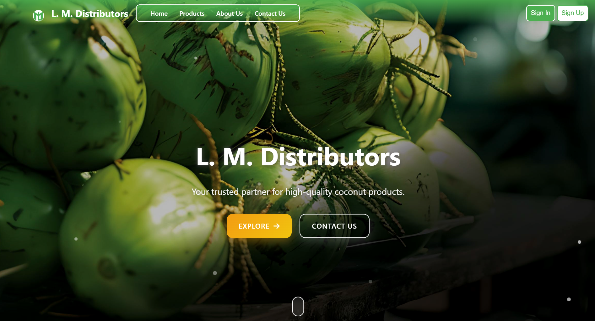

# L. M. Distributors 🥥

A Coconut and coconut-based products Buying and Selling Platform with advanced features for admins, managers, customers, suppliers, and buyers.
- A platform to manage coconut transactions seamlessly.
- Features include admin and manager dashboards, customer and supplier management, and real-time price updates.

## Features

- Admin and Manager Dashboards.
- Role-based access for admins, managers, customers, suppliers, and buyers.
- Dynamic pricing calculations.
- Order requests and detailed reports.
- Custom logo and user-friendly design.
## Technologies Used

- **Frontend:** HTML, CSS, JavaScript
- **Backend:** PHP
- **Database:** MySQL
- **Libraries:** Animate.css
- **Graphics:** Custom favicon and logo
- **Icons:** awasomefonts.com


## Installation

1. Clone the repository to your local machine:
```bash
git clone https://github.com/nipun-munasinghe/LMDistributors.git
```
2. Navigate to the project directory:
```bash
cd LMDistributors
```
3. Start your local server(XAMPP) and set up the database
## Usage

1. Admins 

i. Manage managers
- Add Mangers
- View managers' details
- Check availability of managers
- Activate, deactivate and remove managers

ii. Manage products
- Add new products
- View all products
- Edit product details
- Delete products

iii. Manage orders
- View orders of customers
- Edit the status of the orders
- Delete orders

iv. Today's price list
- Add different price ranges for buyers and suppliers in one page

v. Manage buyers
- View coconut orders
- Take actions for orders (Accepted, Rejected)
- Delete orders

vi. Manage suppliers
- View requests
- Take actions for requests (Accepted, Rejected)
- Delete requests

vii. Manage Messages
- View Messages
- Take actions for requests (unread, read, replied)
- Delete Messages

viii. View Analytics
- View total anlytics in one page (products, accepted orders & requests, messages)

ix. Settings
- Edit user details
- Upload profile picture
- Change password

2. Mangers

i. Manage products
- Add new products
- View all products
- Edit product details
- Delete products

ii. Manage orders
- View orders of customers
- Edit the status of the orders
- Delete orders

iii. Today's price list
- Add different price ranges for buyers and suppliers in one page

iv. Manage buyers
- View coconut orders
- Take actions for orders (Accepted, Rejected)
- Delete orders

v. Manage suppliers
- View requests
- Take actions for requests (Accepted, Rejected)
- Delete requests

vi. Manage Messages
- View Messages
- Take actions for requests (unread, read, replied)
- Delete Messages

vii. View Analytics
- View total anlytics in one page (products, accepted orders & requests, messages)

viii. Settings
- Edit user details
- Upload profile picture
- Change password

3. Customers

i. Products
- View products
- purchase products

ii. Settings
- Edit user details
- Upload profile picture
- Change password

4. Buyers

i. Profile
- View today's price for buyers
- Request an orders

ii. Products
- View products
- purchase products

iii. Settings
- Edit user details
- Upload profile picture
- Change password

5. Supplier

i. Profile
- View today's price for suppliers
- Request to supply

ii. Products
- View products
- purchase products

iii. Settings
- Edit user details
- Upload profile picture
- Change password

6. Guests (No need to login)

i.Cotact us
- Send a direct message

ii. Products
- View products


## Emails & Passwords for demo accounts
1. **Admin**
- Email - *admin1@lm.com*
- Password - *adminkasun3@*

2. **Manager**
- Email - *manager1@lm.com*
- Password - *hashedpassword3*

3. **Customer**
- Email - *customer1@lm.com*
- Password - *hashedpassword5*

4. **Buyer**
- Email - *buyer1@lm.com*
- Password - *hashedpassword9*

5. **Supplier**
- Email - *supplier1@lm.com*
- Password - *hashedpassword7*
  
## Future Improvements

- Implement password hashing option.
- Implement dark mode option.
- Make the website fully responsive for all devices using CSS Grid, Flexbox, and media queries.
- Add more specific roles (e.g., Admin, Manager, Customer, Supplier) with unique access rights for features.
- Enable email notifications for actions like account creation, order confirmations, or password recovery using PHPMailer or a similar library.
- Implement a 2FA mechanism using email or an authenticator app to increase login security.
- Allow customers to track their orders through status updates (e.g., Processing, Dispatched, Delivered).
- Integrate payment options (PayPal, Stripe) to handle transactions securely.

## Color Reference

| Color             | Hex                                                                |
| ----------------- | ------------------------------------------------------------------ |
| Fruit Salad | #4CAF50  |
| Copper Canyon | #8B4513 |
| Gold | #FFD700 |

## Acknowledgements

- Animations: [Animate.css](https://animate.style/)
- Icons: [Font Awesome](https://fontawesome.com/)
- Images: [Freepik](https://www.freepik.com/), [Pixabay](https://pixabay.com/), [Pexels](https://www.pexels.com/)


## Contributing

Contributions are welcome! If you want to improve this website, feel free to fork the repository and submit a pull request.


## Contact

- Developer: Nipun Munasinghe
- LinkedIn: [Nipun Lakmal](https://www.linkedin.com/in/nipun-lakmal-b5b3652bb?utm_source=share&utm_campaign=share_via&utm_content=profile&utm_medium=ios_app)
- Email: [nipunlakmal884@gmail.com](mailto:nipunlakmal884@gmail.com)
- GitHub: [nipun-munasinghe](https://github.com/nipun-munasinghe)
